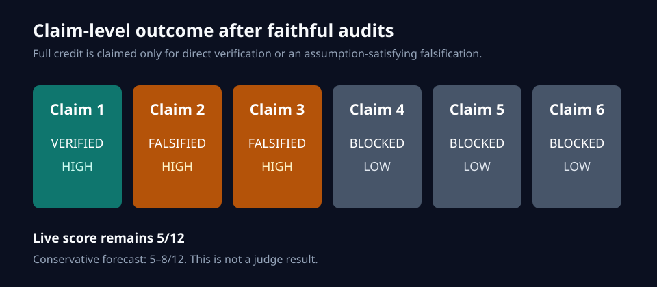
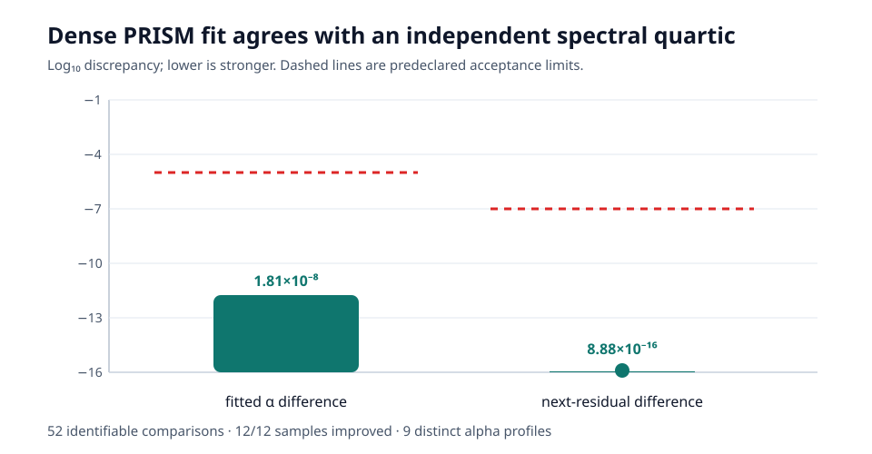
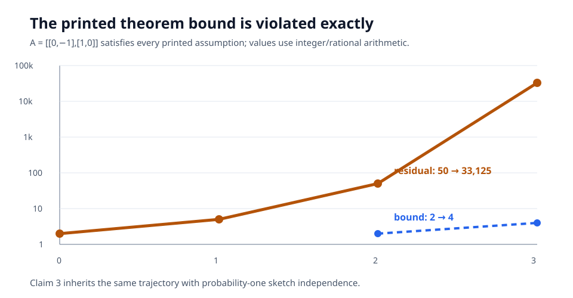
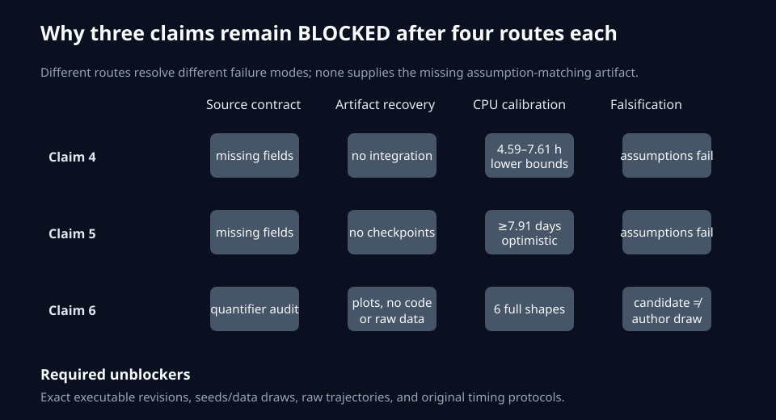

# PRISM, claim by claim: exact mechanisms, exact counterexamples, and honest gaps



PRISM asks whether an iterative matrix-function method can adapt its polynomial
to the spectrum it actually sees, avoiding manually supplied spectral bounds.
The reproduction finds a split result: the adaptive fitting mechanism is
directly verified, the two printed convergence theorems admit one exact
stated-domain counterexample, and the three headline training/robustness
experiments remain blocked by unpublished operational details.

The live judge score remains **5/12**. The conservative post-change forecast is
**5–8/12**, not a judge result.

## What was implemented

The central degree-5 polar update follows the paper's residual definition:

```python
R = I - X.T @ X
alpha = argmin_alpha norm(I - (X @ (I + 0.5*R + alpha*R@R)).T
                          @ (X @ (I + 0.5*R + alpha*R@R)), "fro")**2
```

The primary dense route optimizes this matrix objective directly. An
independent checker diagonalizes `R`, derives the quartic objective in alpha,
and solves for its global bounded optimum. A separate singular-value-coordinate
implementation covers all paper dimensions without materializing the largest
dense matrices. Neither implementation receives a singular-value interval.

The fixed command is identical on every experiment node:

```text
uv run --frozen --python 3.11 python repro/src/run_reproduction.py
```

Python 3.11 and every dependency are locked by `pyproject.toml` and `uv.lock`.
The cumulative run used Hugging Face `cpu-upgrade`: six workers estimated,
64 logical CPUs visible, 248.763 seconds of runner time, 4m47s total job time.

## Claim 1: the adaptive fit is real



Across 12 dense samples and 60 states, 52 alpha comparisons remained
identifiable. Direct matrix minimization and the independently reconstructed
quartic agreed to `1.81e-8` in alpha and `8.88e-16` in the next residual. All
samples improved and nine distinct alpha profiles appeared. Replacing the fit
with constant `3/8` collapses the profiles to one and exits nonzero.

Assessment: **VERIFIED (HIGH)** for the named fitting mechanism. This does not
transfer to the separate sketching theorem or accelerator timing claims.

## Claims 2 and 3: one exact matrix breaks both printed guarantees



For

```text
A = [[0, -1],
     [1,  0]]
```

we have `||A||₂=1` and symmetric `A²=-I`, satisfying every printed assumption.
Exact rational iteration gives residual norms `2, 5, 50, 33125`; Theorem 1's
corresponding bounds are `2` and `4`. For Theorem 2 the residual is a scalar
multiple of identity, so sketching multiplies every alpha objective by a
positive random scalar and cannot alter the minimizer. The same violation
therefore occurs with probability one.

Assessments: **FALSIFIED (HIGH)** for both printed theorem domains. The result
does not assert failure under an unstated `A²` positive-semidefinite condition,
and it does not dispute Theorem 2's arithmetic-cost conjunct alone.

## Claims 4–6: four routes each, still blocked



The training claims describe particular unpublished author runs. The archive
omits exact architectures, data ordering, seeds, integrations, checkpoints,
raw trajectories, and timing protocols. CPU lower bounds establish feasibility
constraints only: deliberately smaller non-Shampoo CIFAR models require at
least 4.59 and 7.61 hours under the fastest calibration, while an optimistic
`6NT` bound for the 200M-token run is 7.91 days. None is a claim proxy.

For Claim 6, finite-generator calibration, limiting-density reconstruction,
archive recovery, and falsification were genuinely different routes. The
deterministic `κ=.1` limiting spectrum does not converge by iteration 32, but
it is not the paper's unpublished random draw. Because the exact source says
“in our experiments,” that candidate cannot falsify the particular experiment.

One source correction matters: Appendix E.2 says PRISM5 used **three** matrix
iterations in the language-model experiment, not five.

Assessments: Claims 4, 5, and 6 are **BLOCKED (LOW)**. Each has three
verification routes plus the mandatory falsification route; none turns missing
evidence or an assumption-violating substitute into a pass.

## Evidence and lineage

| Claim | Paper result | Observed evidence | Assessment |
| --- | --- | --- | --- |
| 1 | Spectrum-adaptive residual-polynomial fit without explicit bounds | Dense and spectral fits agree; 9 adaptive profiles | VERIFIED |
| 2 | Printed quadratic bound for every stated-domain matrix | Exact residual `50` versus bound `2` at `k=2` | FALSIFIED |
| 3 | Sketched bound with probability `≥1-δ` | Same violation with probability `1` | FALSIFIED |
| 4 | PRISM-5 matches/outpaces eigendecomposition in two Shampoo runs | Exact run is operationally unspecified; CPU checks are lower bounds only | BLOCKED |
| 5 | Losses 5.0251 / 5.4523 / 6.8689 | Exact model/data/checkpoints absent; ≥7.91-day optimistic CPU bound | BLOCKED |
| 6 | Stable/faster across six Gaussian/HTMP conditions | Reconstructions diverge from plots but do not match unpublished draw/protocol | BLOCKED |

Important branches:

- [`research/stated-domain-theorem-counterexamples`](https://github.com/MachineLearning-Nerd/icml26-prism-matrix-functions/tree/research/stated-domain-theorem-counterexamples)
- [`research/efficient-dense-prism-mechanism-certificate`](https://github.com/MachineLearning-Nerd/icml26-prism-matrix-functions/tree/research/efficient-dense-prism-mechanism-certificate)
- [`research/claims-4-and-5-four-route-closure`](https://github.com/MachineLearning-Nerd/icml26-prism-matrix-functions/tree/research/claims-4-and-5-four-route-closure)
- [`research/integrated-evaluator-visible-candidate`](https://github.com/MachineLearning-Nerd/icml26-prism-matrix-functions/tree/research/integrated-evaluator-visible-candidate)

## Assessment

The strongest honest result is not a blanket endorsement or rejection of
PRISM. Its adaptive polynomial mechanism survives a direct independent check.
Its two printed theorem domains do not. Its large training and robustness
claims need exact author artifacts or an assumption-matching rerun before they
can be verified or falsified.
